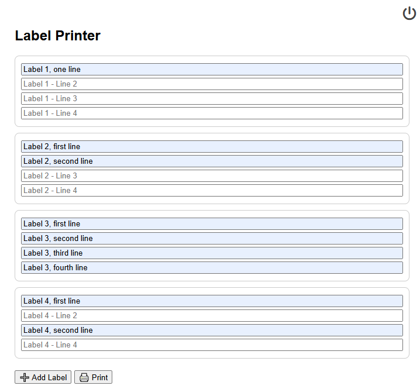
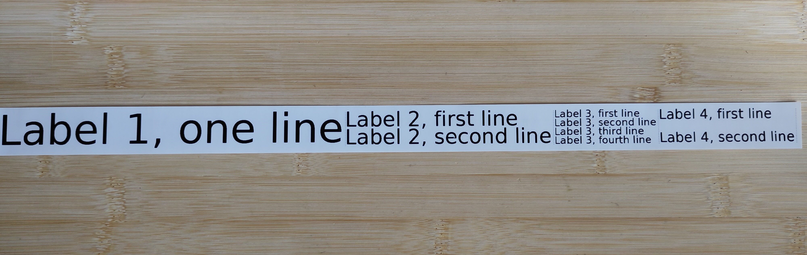
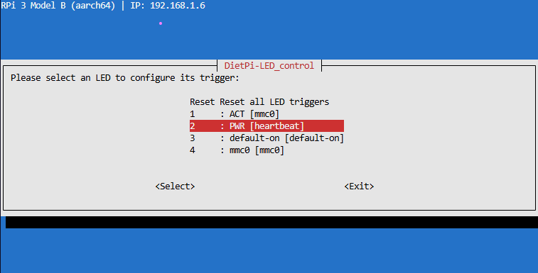
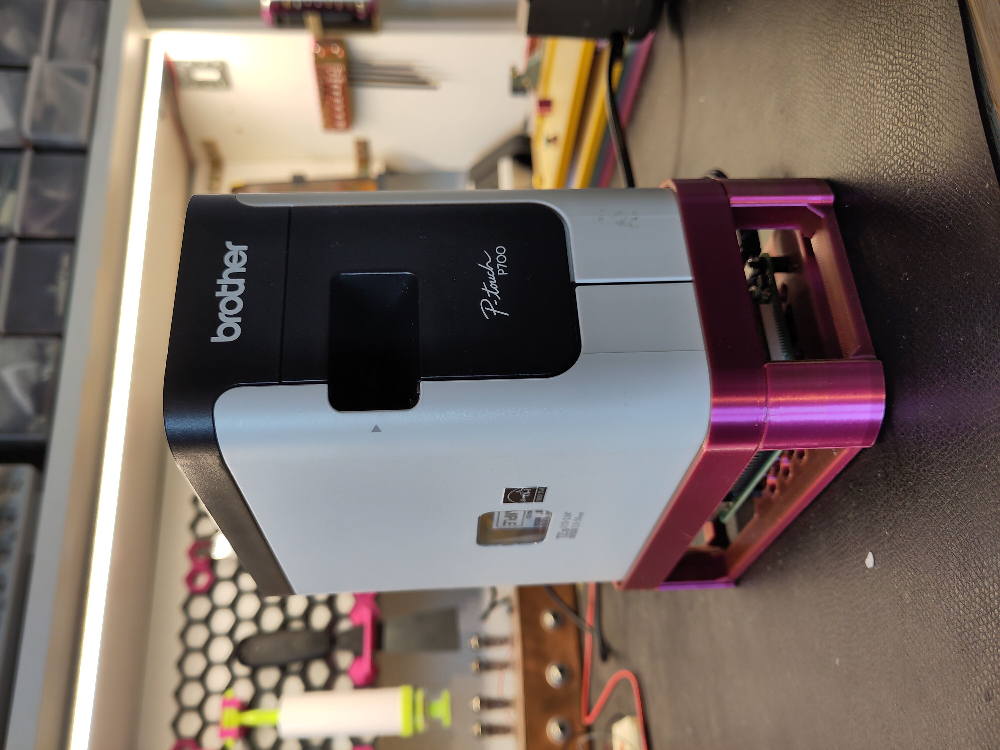

# ptouch-print Web UI
This is a simple web UI to send print commands to a PTouch label printer. The server can run on an SBC like the Raspberry Pi 3, which is connected to a local network and a label printer via USB. [ptouch-print](https://dominic.familie-radermacher.ch/projekte/ptouch-print/) by Dominic Radermacher is used to send the commands to the printer.

***Limitations:*** *`ptouch-print` lets you set fonts, print images, and print to image for preview purposes. At the moment, these features are not implemented here.*  
  
***Disclaimer:*** *This is my first attempt at web development and working with docker. So, the code and workflow might not be state of the art.*

## User Manual
### Startup
The PTouch printer needs to be turned on (this may need to be done before the SBC finishes its boot routine) and "Editor Lite" must deactivated. To do that, if the Editor Lite LED is lit, press the corresponding button until it turns off.
### Web UI
In your browser, enter the `http://<sbc_ip>:5000` (e.g. `http://192.168.1.5:5000`).  
The UI should be self-explanatory. Each label can have up to four lines. The font size is scaled automatically. To save material, you may want to print multiple labels in a sequence. Clicking on "Add Label" before printing lets you add as many labels as you want. The labels are separated by a cut mark (a vertical dashed line). Below, you can see an example user input with its corresponding label:  
  

Following the [Build & Run](#build--run) steps allows you to shut down the host by clicking on the "On/Off" button in the top right corner. 

## Build & Run
### Requirements
I am using [DietPi](https://dietpi.com) as the OS on a Raspberry Pi 3. It is lightweight, easily customizable, and compatible for many SBCs.  
Docker needs to be installed. On DietPi, you may install and setup Docker using `dietpi-software`. According to [this guide](https://pimylifeup.com/raspberry-pi-docker/), the steps are:  
```
sudo apt update
sudo apt upgrade
curl -sSL https://get.docker.com | sh
```

### Preparation
**Configuration:**  
  
In `config/config.toml`, fill in the host name and ip address used for ssh login, e.g.:  
``` 
[config]
host_name = "dietpi"
ip = "192.168.1.5"
```
This will be used later to shut down the host via the web ui.  

**Prepare scripts:** 
   
In `scripts/setup-shutdown.sh`, set `HOST_NAME` to the same as in `config/config.toml`, e.g. `HOST_NAME="dietpi"`  
***Note:*** *This step will hopefully be obsolete. I just haven't found an easy way to parse a `.toml` file in a bash script yet...*  

Make the scripts executable:  
```
chmod +x scripts/*
```

### Run
**Using the `deploy.sh` script:**  
***Caution:*** *The Docker container runs in privileged mode. As I understand it, this is needed to access USB devices.*
  
`deploy.sh` will execute `setup-shutdown.sh` (which prepares everything for shutting down the host from within the container) and `start-container.sh` (which builds and starts the container).  
  
Run the script:  
```
scripts/deploy.sh
```    
***Note:*** *This script is only needed the first time you run the app. It sets the container's `--restart` flag to `always`. This way, the container will automatically start after the SBC boots. After the initial start, you can also run the container with the `start-container.sh` script.*  

### Optional: Heartbeat Indicator on PWR LED
To indicate whether the boot sequence or shutdown is complete, you may configure the PWR LED on the SBC to show a heartbeat. The LED will be constantly on during boot-up and after shut down. This way, you'll know when it is safe to cut the power.  
On DietPi, enter `diepti-led_control` into the terminal and set the trigger for the `PWR` LED to `heartbeat`



## Development with VSC and Dev Container
With Visual Stuio Code, you may want to use the **Remote-SSH** extension to work on a headless Raspberry Pi (or other SBC).
Using the **Dev Container** extension in Visual Studio Code, you can reopen the repository in a dev container. To run the code there, run `python app.py` and open `http://localhost:5000` in your browser.  
### Optional: Simulate shutdown and run the flask in debug mode:  
The following needs to be in `devcontainer.json`:  
```
"containerEnv": {
  "DEV_MODE": "1"
}
```

## Optional: PTouch P700 Stand
I designed a 3D-printable stand for the PTouch P700 and a Raspberry Pi. The model is available on [Printables](TODO).


## Known issues
* After shutting down using the "On/Off" button, a message may appear that this didn't work even though the SBC was shut down.